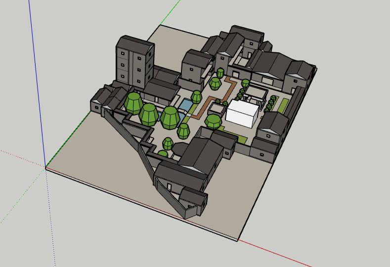
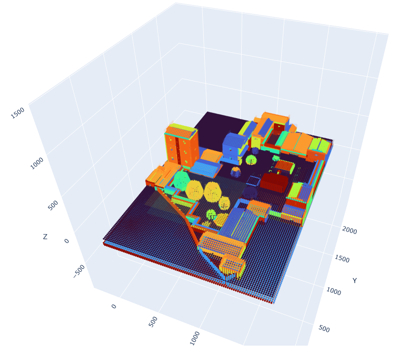
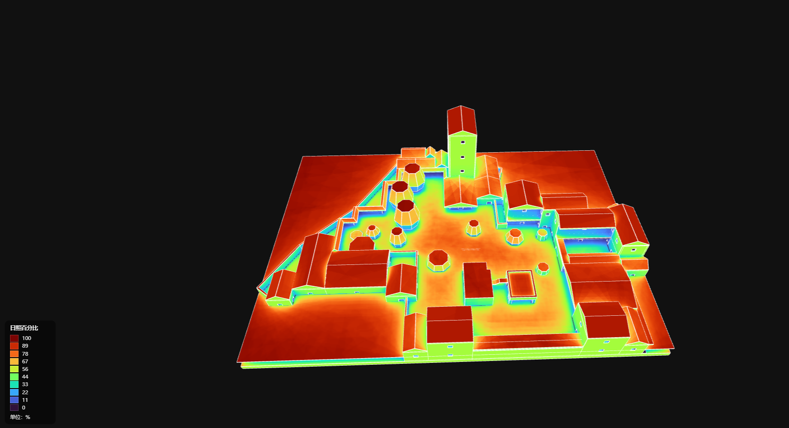
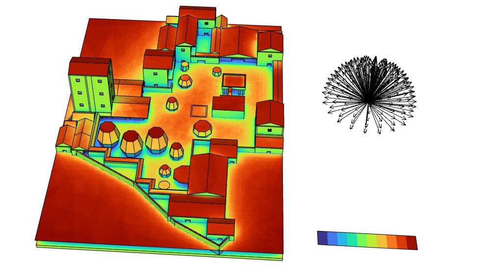
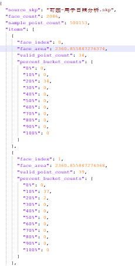

## 1 环境依赖

运行本项目前，请先安装以下Python库：

`pip install numpy taichi shapely pvlib pytz matplotlib`

## 2 使用说明

### 2.1 导入模型与前处理

注：导入的模型如图1所示，不必过于精细。模型复杂度越高，计算耗时越长。

图1 导入的模型示意图

### 2.2 模型设置

#### 2.2.1 必做项

在以下三个脚本中任选一个进行修改：

- `002采样点生成.py`
- `003阴影分析并插值预览.py`
- `004阴影分析并导出到SU.py`

需要修改的参数如下：

- `skp_path`：模型所在的`.skp`文件路径
- `dll_path`：SketchUp2025的`SketchUpAPI.dll`文件路径

此外，还需要对输入模型进行以下前处理：

- 将模型全部炸开成面

#### 2.2.2 选做项

`sun_dirs`可根据自己的需求进行设置，通常保留一个即可。

#### 2.2.3 运行

### 2.3 运行结果说明

#### 2.3.1 `002采样点生成.py`

目的：观察采样点的分布。

图2 `002采样点生成.py`模拟结果

#### 2.3.2 `003阴影分析并插值预览.py`

运行结果如图3所示。

注：运行后直接弹出的网站可能无法正常着色。此时请先关闭网页，再双击`web模型/index.html`重新打开。

图3 `003阴影分析并插值预览.py`模拟结果

#### 2.3.3 `004阴影分析并导出到SU.py`

运行结果如图4和图5所示。

注：模拟结果保存在输入模型所在的文件夹中。

图4 `004阴影分析并导出到SU.py`模拟的SKP结果

图5 `004阴影分析并导出到SU.py`模拟的JSON结果

## 3 参考文献

[1]. Wu, R., et al., A fast and accurate mean radiant temperature model for courtyards: Evidence from the Keyuan Garden in central Guangdong, China. Building and Environment, 2023. 229: p. 109916.
